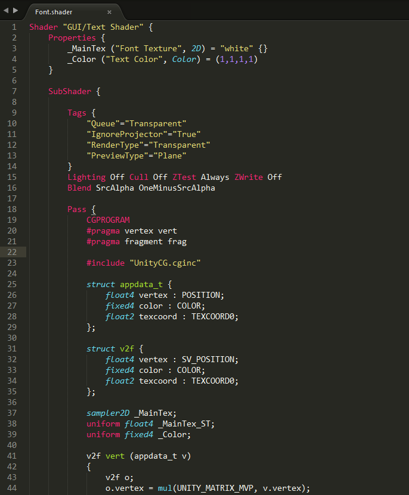

# UnityShaderST3

UnityShaderST3是一款旨在提升编辑UnityShader时幸福指数的SublimeText3插件，提供类IDE的功能，且跟随Unity最新的发行版本。

## 主要功能

- 代码高亮

- 自动补全

- 格式化代码（整合自针对.shader语法的parser，参见[beautify_unity_shader](https://github.com/waqiju/beautify_unity_shader)）

- 定义跳转

## 预览

    
    

## 特性

- 全面的针对.shader和.cginc文件语法高亮规则

- 广泛的代码补全提示，包括有关键字、CG内置函数、Unity3D内置函数等

- 准确的代码格式化

- 支持定义跳转到Unity3D内置宏、变量、函数

- 可配置的Unity3D版本，以应对不同版本间内置宏和函数的不兼容变化。详情请见，Menu->Peferences->Package Settings->Unity Shader->Setting - Default

- 跟随Unity3D(5.X)和SublimeText(3.X)的版本更新

## 安装

**通过Package Control（推荐方式）**

在Sublime Pcakage Control官网上找到Unity Shader，然后安装。

https://packagecontrol.io/packages/Unity%20Shader

**手动**

1. 通过git或者下载zip，把整个项目拷贝到本地

2. 把下载的项目目录移动到Sublime Text的插件目录，Menu->Preferences->Browse Packages

## 反馈

欢迎在[Github Issue](https://github.com/waqiju/unity_shader_st3/issues)上提出反馈。^-^

## 致谢

在开发初期，[cjsjy123 / Unity-Shader](https://github.com/cjsjy123/Unity-Shader)给了我很多启示，展示给我了一个Sublime Text插件的基本框架应该是怎样子的。